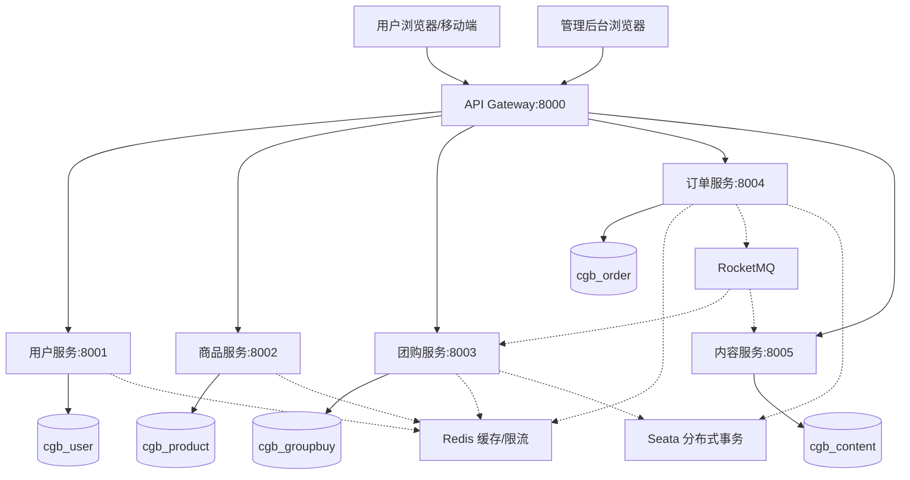
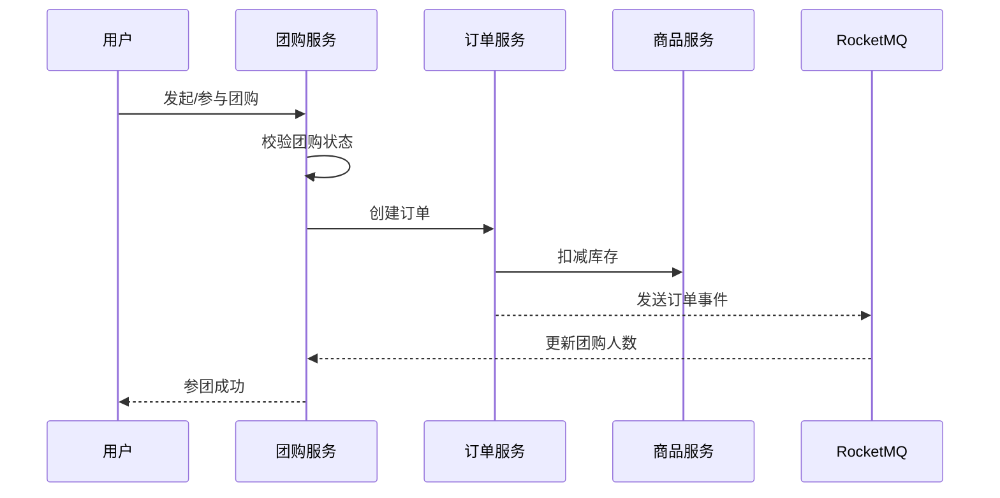

# 社区团购系统（微服务版）
<div align="center">


### **基于 Spring Boot 3 + Spring Cloud 2024 + Vue 3 的微服务社区团购平台**

[](docs/quick-start.md)
[](docs/architecture.md)
[](docs/api.md)
[](docs/database.md)
[](docs/faq.md)

</div>

---

## 项目简介

社区团购系统是一个功能完善的**微服务电商应用**，以微信小程序式社区团购为业务蓝本，提供商品信息管理、团购活动发布（团长发起/参团记录/状态流转）、购物车、订单管理、收藏管理、社区资讯发布、论坛互动等核心业务功能。

系统分为**管理后台**和**用户前台**两套独立界面，分别满足管理员运营和普通用户使用的需求。

---

## 系统架构



### 核心业务流程



---

## 核心特性

| 特性 | 说明 |
|------|------|
| 🏗️ **微服务架构** | 6 个微服务模块独立部署，各服务拥有独立数据库 |
| 🌐 **API 网关** | 统一入口，动态路由、全局 CORS、鉴权过滤器 |
| 🔐 **JWT + Redis 认证** | Token 绑定客户端 IP，支持主动失效 |
| 🔗 **OpenFeign 服务间调用** | 4 个 Feign 客户端接口，支持熔断降级 |
| 🗄️ **Flyway 数据库迁移** | 启动即自动执行建表 + 种子数据 |
| 🛡️ **Redis + Lua 接口限流** | 按客户端 IP 隔离，10+ 核心接口启用 |
| 📨 **RocketMQ 消息队列** | 4 个消费者处理异步事件 |
| 🔗 **Seata 分布式事务** | AT 模式，覆盖参团、订单、购物车等核心流程 |
| 👥 **双端设计** | 管理后台（端口 8081）+ 用户前台（端口 8084） |
| 📊 **ECharts 数据可视化** | 后台首页集成数据图表展示 |

---

## 技术栈

| 分类 | 技术 |
|------|------|
| **后端框架** | Spring Boot 3.4.1, Spring Cloud 2024.0.0, MyBatis Plus 3.5.9 |
| **API 网关** | Spring Cloud Gateway |
| **服务间通信** | Spring Cloud OpenFeign + FallbackFactory |
| **认证与安全** | JWT (jjwt 0.12.6), Redis (Lettuce), BCryptPasswordEncoder |
| **缓存与限流** | Redis 7 + Lua 原子限流 |
| **数据库** | MySQL 8.0（每服务独立库）, Druid 1.2.24 |
| **API 文档** | SpringDoc OpenAPI 2.8.15 (Swagger UI) |
| **前端** | Vue 3.5.34, Vite 8, Element Plus 2.14.1, Pinia 3 |
| **服务注册/配置** | Nacos (Spring Cloud Alibaba 2023.0.1.2) |
| **消息队列** | RocketMQ 2.3.1 |
| **分布式事务** | Seata 2.0.0 (AT 模式) |

---

## 快速开始

### 环境要求

- JDK >= 17
- Maven >= 3.6
- Node.js >= 16
- MySQL >= 8.0
- Redis >= 7
- Nacos >= 2023.0
- RocketMQ >= 4.9
- Seata >= 2.0

### 一键启动（Docker Compose）

```bash
cd community-group-buying-microservices
docker-compose up -d
```

### 手动启动

1. **创建数据库**：`cgb_user` / `cgb_product` / `cgb_groupbuy` / `cgb_order` / `cgb_content`
2. **启动中间件**：Nacos (8848) / RocketMQ (9876) / Seata (8091)
3. **导入 Nacos 配置**：`nacos-config/nacos-config-templates.yml`
4. **编译并启动后端**：
   ```bash
   mvn clean install -DskipTests
   # 依次启动 6 个微服务
   ```
5. **启动前端**：
   ```bash
   cd admin-vue3 && npm install && npm run dev
   cd ../front-vue3 && npm install && npm run dev
   ```

详细步骤请参阅 [快速开始文档](docs/quick-start.md)。

---

## 项目结构

```
communitygroupbuyingsystemMicroserviceCase/
├── community-group-buying-microservices/    # 后端微服务
│   ├── cgb-common/                          # 公共模块（工具类/Feign/MQ/认证）
│   ├── cgb-gateway/                         # API 网关（端口 8000）
│   ├── cgb-user-service/                    # 用户服务（端口 8001）
│   ├── cgb-product-service/                 # 商品服务（端口 8002）
│   ├── cgb-groupbuy-service/                # 团购服务（端口 8003）
│   ├── cgb-order-service/                   # 订单服务（端口 8004）
│   ├── cgb-content-service/                 # 内容服务（端口 8005）
│   └── nacos-config/                        # Nacos 配置模板
├── admin-vue3/                              # 管理后台前端（端口 8081）
├── front-vue3/                              # 用户前台前端（端口 8084）
└── docs/                                    # 项目文档
```

---

## 功能模块

<details>
<summary><b>管理后台（admin-vue3）- 点击展开</b></summary>

| 模块 | 说明 |
|------|------|
| 首页 | 数据概览看板，ECharts 图表可视化 |
| 用户管理 | 用户信息增删改查、账号状态管理 |
| 商品类型 | 商品分类管理 |
| 商品信息 | 商品信息 CRUD、图片上传、分类筛选 |
| 团购信息 | 团购活动发布、价格设置、时间管理 |
| 购物车管理 | 查看全部用户购物车记录 |
| 订单管理 | 订单列表、状态流转、发货管理 |
| 收藏管理 | 商品/团购收藏记录查看 |
| 地址管理 | 用户收货地址管理 |
| 新闻资讯 | 社区资讯发布与管理 |
| 商品评论 | 商品评论审核与回复 |
| 团购评论 | 团购评论审核与回复 |
| 系统配置 | 系统参数配置管理 |

</details>

<details>
<summary><b>用户前台（front-vue3）- 点击展开</b></summary>

| 模块 | 说明 |
|------|------|
| 首页 | 商品推荐、团购活动、资讯轮播 |
| 商品列表/详情 | 分类浏览、关键词搜索、商品详情 |
| 团购列表/详情 | 团购活动浏览、参团操作 |
| 资讯列表/详情 | 社区资讯浏览 |
| 购物车 | 商品选购、数量调整、结算 |
| 我的订单 | 订单列表、状态跟踪 |
| 我的地址 | 收货地址增删改、默认地址设置 |
| 我的收藏 | 收藏商品/团购列表 |
| 个人中心 | 个人信息修改、密码修改 |

</details>

---

## 微服务架构

### 服务注册与端口

| 服务 | 端口 | 数据库 |
|------|------|--------|
| `cgb-gateway` | 8000 | — |
| `cgb-user-service` | 8001 | `cgb_user` |
| `cgb-product-service` | 8002 | `cgb_product` |
| `cgb-groupbuy-service` | 8003 | `cgb_groupbuy` |
| `cgb-order-service` | 8004 | `cgb_order` |
| `cgb-content-service` | 8005 | `cgb_content` |

### 网关路由规则

| 路径前缀 | 路由目标 | 说明 |
|----------|---------|------|
| `/user/**` | `lb://cgb-user-service` | 用户服务 |
| `/product/**` | `lb://cgb-product-service` | 商品服务 |
| `/groupbuy/**` | `lb://cgb-groupbuy-service` | 团购服务 |
| `/order/**` | `lb://cgb-order-service` | 订单服务 |
| `/content/**` | `lb://cgb-content-service` | 内容服务 |

> 💡 `StripPrefix=1`：转发时去掉第一级路径前缀

详细架构说明请参阅 [架构设计文档](docs/architecture.md)。

---

## API 响应格式

所有后端接口统一响应格式：

```json
{
  "code": 0,
  "msg": "操作成功",
  "data": {},
  "token": "xxx"
}
```

> ⚠️ 成功响应码为 `0`，非 0 表示失败。登录接口会额外返回 `token` 字段。

---

## 开发环境

### 前端代理配置

```javascript
// vite.config.js
proxy: {
  '/api': {
    target: 'http://localhost:8000',
    changeOrigin: true,
    rewrite: (path) => path.replace(/^\/api/, '')
  }
}
```

> 💡 请求链路：`/api/user/yonghu/list` → Vite 代理去 `/api` → 网关 `/user/yonghu/list` → StripPrefix → 用户服务 `/yonghu/list`

### Swagger API 文档

各服务访问 `http://localhost:{服务端口}/swagger-ui.html` 查看 API 文档并在线调试。

---

## 文档导航

| 文档 | 说明 |
|------|------|
| [快速开始](docs/quick-start.md) | 环境要求、部署步骤、生产部署 |
| [架构设计](docs/architecture.md) | 网关路由、Feign 通信、RocketMQ、Seata |
| [API 接口](docs/api.md) | 各服务接口路径、响应格式、开发代理 |
| [数据库设计](docs/database.md) | 5 个数据库、18 张表结构 |
| [安全机制](docs/security.md) | JWT 鉴权、Redis 限流、前端安全 |
| [常见问题](docs/faq.md) | 网关/Feign/Seata/RocketMQ 等常见问题 |
| [更新日志](docs/changelog.md) | 项目更新记录 |

---

## 贡献指南

1. Fork 本仓库
2. 创建特性分支：`git checkout -b feature/AmazingFeature`
3. 提交更改：`git commit -m 'Add some AmazingFeature'`
4. 推送分支：`git push origin feature/AmazingFeature`
5. 提交 Pull Request

---

## 许可证

本项目仅供学习交流使用，采用 MIT 许可证。

---

## 联系方式

如有问题或建议，欢迎提 Issue 或在社区讨论。

---

<div align="center">

*最后更新时间：2026-06-14*

⭐ 如果这个项目对你有帮助，请给它一个 Star！

</div>
